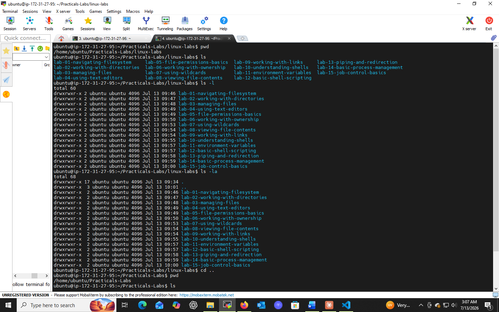
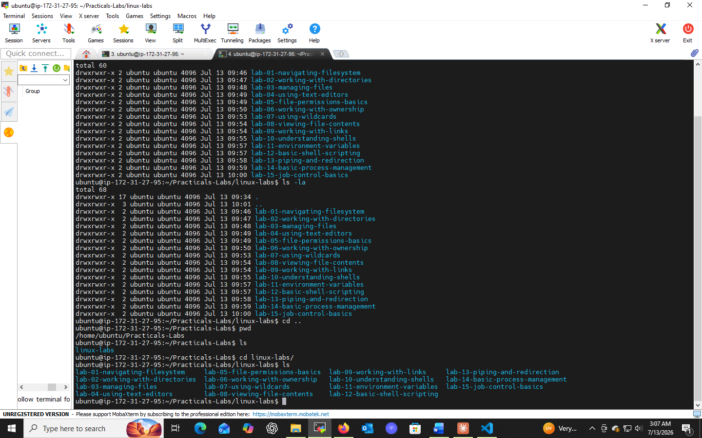

# Lab 01: Navigating the Filesystem

## 📌 Objectives
- Understand the basic structure of a filesystem
- Learn how to determine the current working directory
- Practice listing files and directories
- Master navigating the filesystem using commands

## 🔧 Prerequisites
- Basic understanding of command-line interface (CLI)
- Access to a Unix-like operating system (Linux, macOS)
- Terminal or command prompt access

## 💻 Tasks & Commands

### Task 1: Identify the Current Directory
```bash
pwd
```
`pwd` (print working directory) prints the absolute path of your current location in the filesystem — helps confirm where you are.

### Task 2: List Directory Contents
```bash
ls
```
Lists files and directories in the current directory.

```bash
ls -la
```
- `-l` → long/detailed format listing
- `-a` → include hidden files (files starting with `.`)

### Task 3: Change Directories
```bash
cd [directory_path]
cd Documents        # relative path
cd /home/user/Docs  # absolute path
```
```bash
cd ..
```
Moves one level up the directory hierarchy.

## 🎯 Key Concepts
| Command | Purpose |
|---------|---------|
| `pwd` | Print current directory path |
| `ls` | List directory contents |
| `cd` | Change directory |

## ✅ Conclusion
This lab built the foundation for navigating any Unix-like filesystem confidently using `pwd`, `ls`, and `cd` — essential for every task that follows.
## 📸 Practice Screenshot


