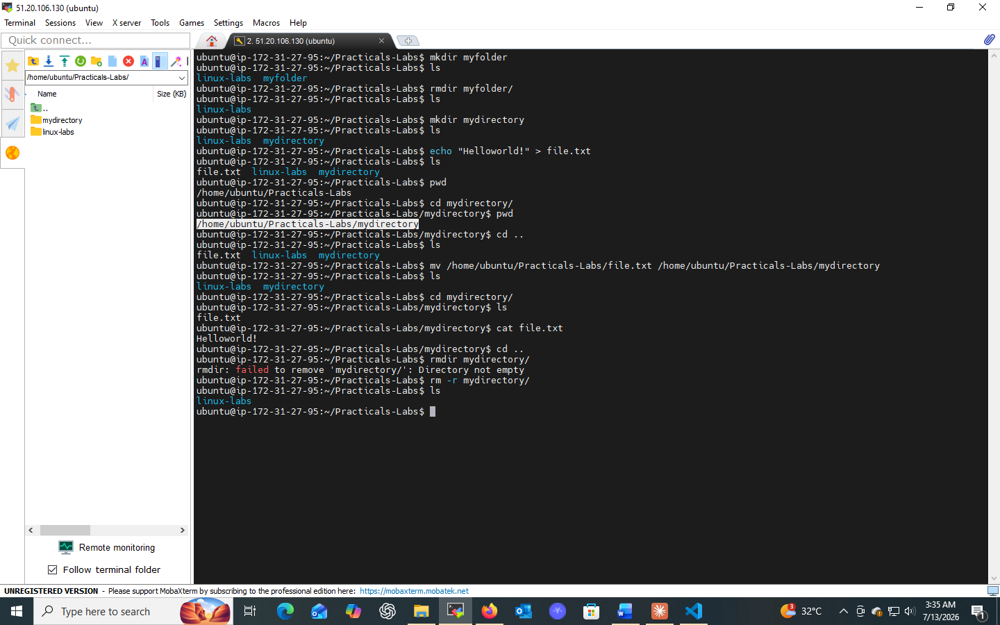

# Lab 02: Working with Directories

## 📌 Objectives
- Understand basic operations for managing directories
- Learn to create, remove, move, and rename directories using the command line

## 🔧 Prerequisites
- Basic understanding of using a terminal
- Access to a Unix-like operating system (Linux, macOS)

## 💻 Tasks & Commands

### Task 1: Create a Directory (`mkdir`)
```bash
mkdir my_new_directory
ls
```
`mkdir` (make directory) creates a new, empty directory at the specified path.

```bash
mkdir existing_directory/sub_directory
```
Creates a subdirectory inside an existing directory.

### Task 2: Remove a Directory (`rmdir`)
```bash
rmdir my_new_directory
ls
```
`rmdir` removes only **empty** directories — it fails if the directory has content.

```bash
rm -r directory_with_contents
```
⚠️ **Caution:** `rm -r` recursively removes a directory and everything inside it — irreversible.

### Task 3: Move or Rename a Directory (`mv`)
```bash
mv old_directory new_directory      # rename
mv new_directory parent_directory/  # move
ls parent_directory/
```
`mv` is used for **both** moving and renaming files/directories.

## 🎯 Key Concepts
| Command | Purpose |
|---------|---------|
| `mkdir` | Create new directories |
| `rmdir` | Remove empty directories |
| `mv` | Move or rename directories |

## ✅ Conclusion
This lab laid the groundwork for efficient filesystem organization — a skill essential for advanced system administration tasks ahead.

## 📸 Practice Screenshot

