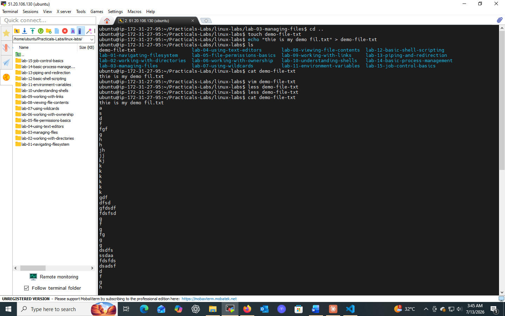
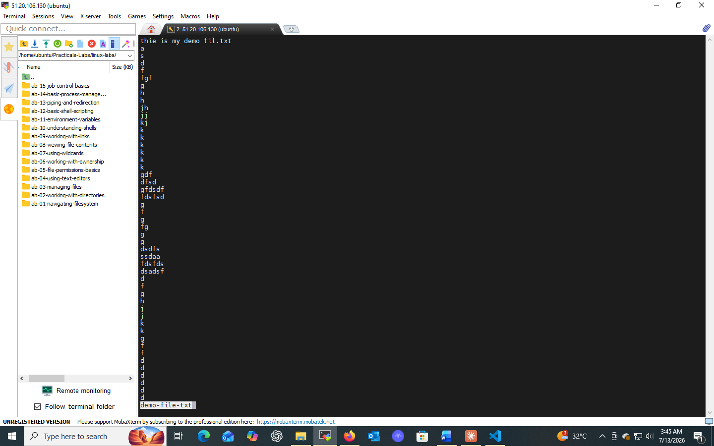
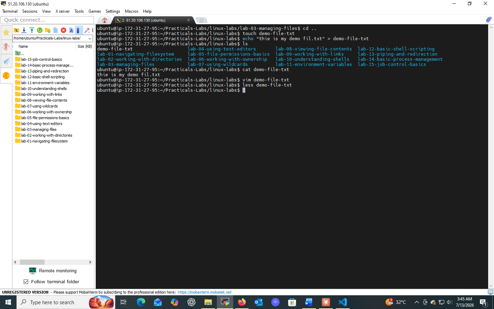

# Lab 03: Managing Files

## 📌 Objectives
- Demonstrate basic file management tasks in a Unix/Linux environment
- Get familiar with creating, viewing, and deleting files using CLI tools

## 🔧 Prerequisites
- Basic understanding of operating system concepts
- Access to a Unix/Linux terminal

## 💻 Tasks & Commands

### Task 1: Create an Empty File (`touch`)
```bash
touch myfile.txt
```
`touch` creates empty files and also updates access/modification timestamps of existing files.

### Task 2: Remove a File (`rm`)
```bash
ls               # verify file exists
rm myfile.txt    # delete it
ls               # confirm removal
```
⚠️ **Caution:** `rm` is irreversible — especially dangerous with wildcards like `rm *`.

### Task 3: View File Content (`cat` and `less`)
```bash
echo "Hello, this is a sample text file." > sample.txt
cat sample.txt      # view small files instantly
less sample.txt     # paginated viewing for large files (press q to quit)
```
`cat` is best for small files; `less` allows scrolling and searching in large files.

## 🎯 Key Concepts
| Command | Purpose |
|---------|---------|
| `touch` | Create empty files / update timestamps |
| `rm` | Delete files |
| `cat` | Display file content (small files) |
| `less` | Paginated file viewing (large files) |

## ✅ Conclusion
Practiced fundamental file handling with `touch`, `rm`, `cat`, and `less` — core skills for daily Linux administration.




