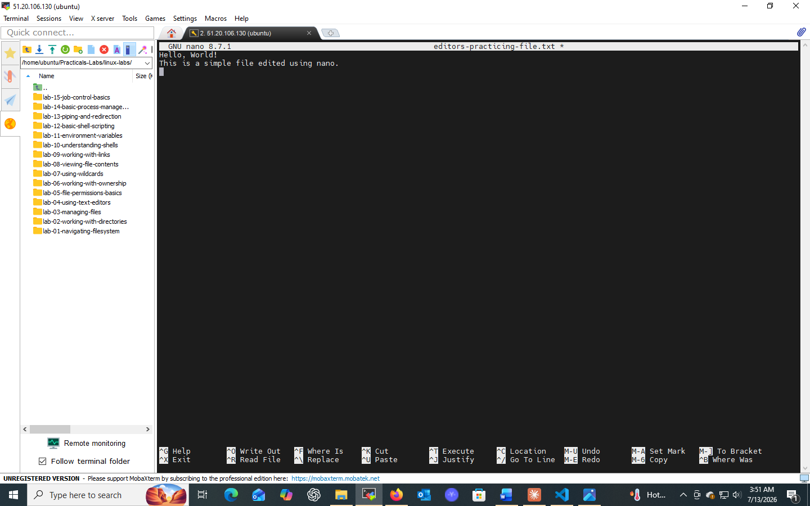
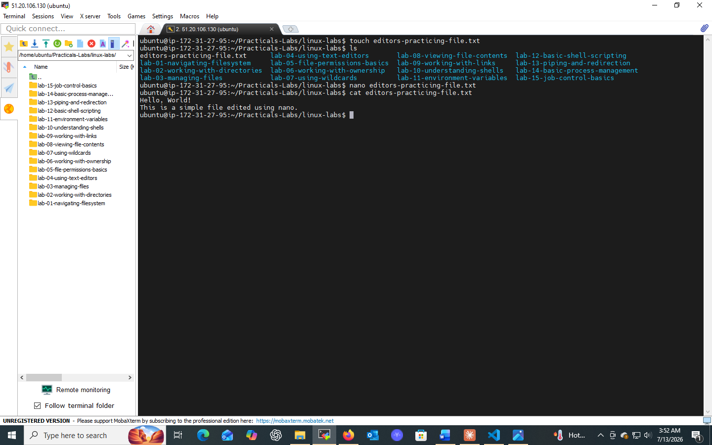
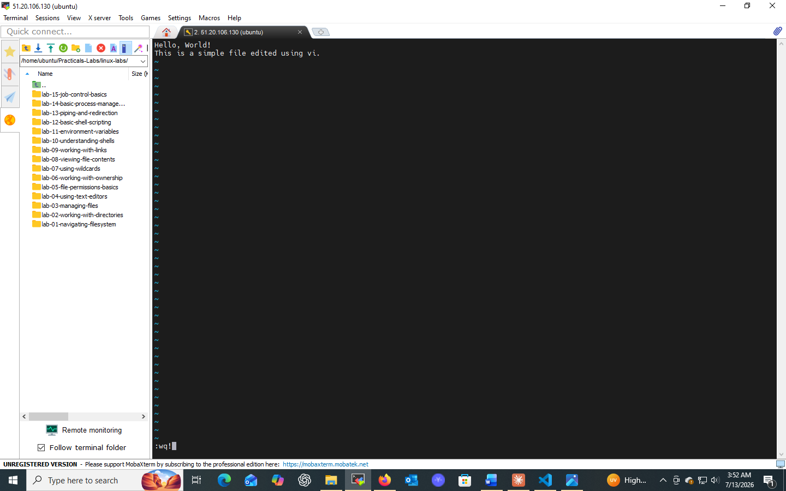
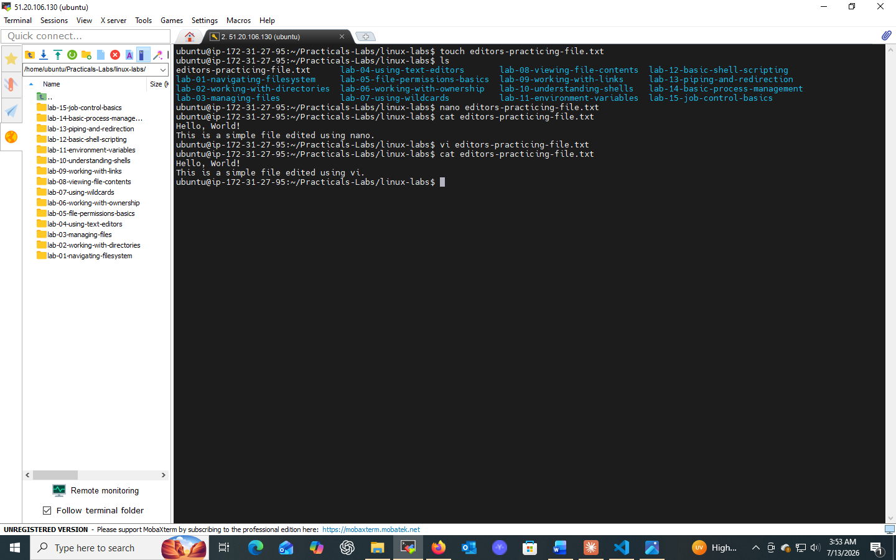

# Lab 04: Using Text Editors

## 📌 Objectives
- Understand the basic functionalities of `nano` and `vi` text editors
- Learn to create, open, edit, and save files using these editors
- Navigate and execute commands efficiently within the editor environment

## 🔧 Prerequisites
- Basic familiarity with the command-line interface
- Access to a Unix/Linux system with `nano` and `vi` installed

## 💻 Tasks & Commands

### Task 1: Edit a File Using `nano`
```bash
nano example.txt
```
Opens (or creates) `example.txt` in the nano editor. Type text directly — nano is WYSIWYG (What You See Is What You Get).

**Save & Exit:**
| Shortcut | Action |
|----------|--------|
| `Ctrl + O` | Save changes |
| `Ctrl + X` | Exit editor |

### Task 2: Edit a File Using `vi`
```bash
vi example.txt
```
- Press `i` → enters **Insert Mode** (for typing/editing text)
- Press `Esc` → returns to **Normal Mode**
- Type `:wq` → writes (saves) file and quits

`vi` has three primary modes: **Normal**, **Insert**, and **Command-line**.

## 🎯 Key Concepts
| Editor | Style | Best For |
|--------|-------|----------|
| `nano` | Beginner-friendly, WYSIWYG | Quick edits |
| `vi` | Modal, advanced | Scripting, large files, server admin |

## ✅ Conclusion
Learned two essential Linux text editors — `nano` for simplicity and `vi` for advanced, efficient editing. Mastery of both boosts productivity in system administration and development.

## 📸 Practice Screenshot




