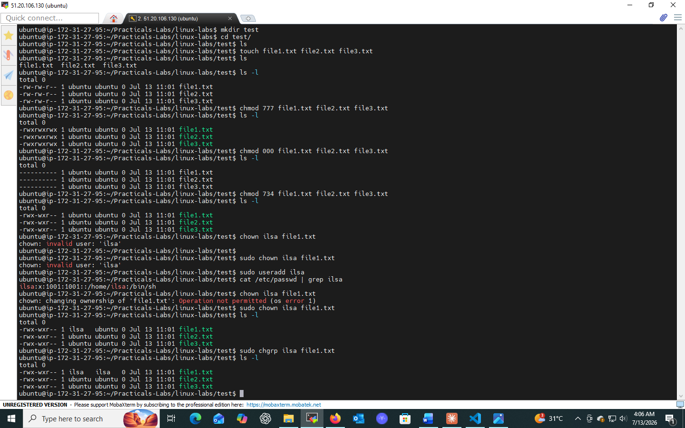

# Lab 05: File Permissions Basics

## 📌 Objectives
- Understand the concepts of Linux file permissions
- Learn how to check file permissions
- Acquire skills to modify permissions with `chmod`

## 🔧 Prerequisites
- Basic understanding of the Linux command line
- Access to a Linux-based system or terminal emulator

## 💻 Tasks & Commands

### Task 1: Check Permissions (`ls -l`)
```bash
ls -l
```
Example output:
```
-rw-r--r--  1 user user 4096 Oct 10 14:32 example.txt
```
- 1st character: file type (`-` = file, `d` = directory)
- Next 9 characters: permissions for **owner**, **group**, **others**
- `rw-r--r--` → owner: read+write, group: read-only, others: read-only

### Task 2: Modify Permissions (`chmod`) — Symbolic Notation
```bash
chmod g+w example.txt
ls -l
```
`g+w` adds write permission for the group. Result: `-rw-rw-r--`

### Task 3: Modify Permissions — Numeric (Octal) Notation
```bash
chmod 764 example.txt
```
| Digit | Meaning |
|-------|---------|
| 7 (user) | read + write + execute (rwx) |
| 6 (group) | read + write (rw-) |
| 4 (others) | read only (r--) |

## 🎯 Key Concepts
| Command | Purpose |
|---------|---------|
| `ls -l` | View file permissions |
| `chmod` | Change permission mode bits |

## ✅ Conclusion
Learned to check and modify file permissions using both symbolic (`g+w`) and numeric (`764`) notation — critical for security in multi-user Linux environments.

## 📸 Practice Screenshot

