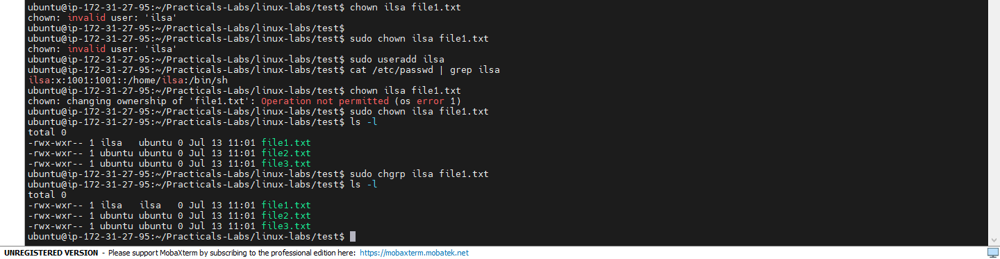

# Lab 06: Working with Ownership

## 📌 Objectives
- Understand file and directory ownership in Linux
- Learn how to change file ownership using `chown`
- Learn how to change group ownership using `chgrp`
- Explore practical examples of managing ownership

## 🔧 Prerequisites
- Basic understanding of Linux CLI
- Access to a Linux-based system
- Basic understanding of file permissions (see Lab 05)

## 💻 Tasks & Commands

### Task 1: Check File Ownership
```bash
ls -l
```
Example:
```
-rw-r--r-- 1 user1 group1 1056 Jan 21 09:30 example.txt
```
Here, `user1` is the **owner** and `group1` is the **group**.

### Task 2: Change Owner (`chown`)
```bash
sudo chown newuser example.txt
ls -l
```
Changes the owner of `example.txt` to `newuser`. `sudo` is required for superuser privileges.

### Task 3: Change Group Ownership (`chgrp`)
```bash
sudo chgrp newgroup example.txt
ls -l
```
Changes the group ownership of `example.txt` to `newgroup`.

## 🎯 Key Concepts
| Command | Purpose |
|---------|---------|
| `ls -l` | View ownership info |
| `chown` | Change file owner |
| `chgrp` | Change group ownership |

## 💡 Case Study: Secure Web Server
When deploying a web server, different teams often need access to different parts of a directory. Solution:
1. Create user accounts per team
2. Assign directory ownership to team leads
3. Use `chown`/`chgrp` to manage collaboration securely

## ✅ Conclusion
Practiced managing file and directory ownership with `chown` and `chgrp` — essential for secure, multi-user Linux systems.

## 📸 Practice Screenshot

