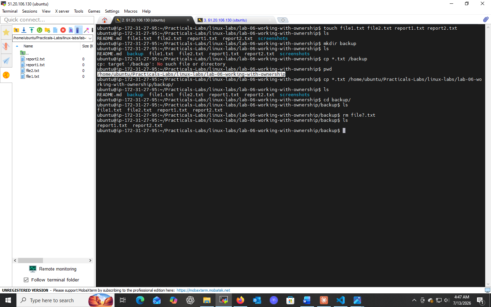

# Lab 07: Using Wildcards

## 📌 Objectives
- Understand the concept of wildcards in file management
- Learn to use wildcards for efficient file operations
- Practice with `cp` and `rm` using wildcards

## 🔧 Prerequisites
- Basic knowledge of the Unix/Linux CLI
- Familiarity with `cp` and `rm`

## 📝 Key Concepts
- **Wildcards:** Special characters representing one or more characters in file/directory names
- **Pattern Matching:** Using wildcards to select a set of files instead of naming them individually

## 💻 Tasks & Commands

### Task 1: Copy Multiple Files with `*`
```bash
touch file1.txt file2.txt report1.txt report2.txt
mkdir backup
cp *.txt backup/
cd backup && ls
```
`*` matches any number of characters — `*.txt` copies **all** `.txt` files into `backup/`.

### Task 2: Remove Specific Files with `?`
```bash
cd ..
rm file?.txt
ls
```
`?` matches exactly **one** character. `file?.txt` matches `file1.txt` and `file2.txt` but not `report1.txt`.

## 🎯 Key Concepts
| Wildcard | Matches |
|----------|---------|
| `*` | Any number of characters (including zero) |
| `?` | Exactly one character |

## ✅ Conclusion
Wildcards (`*`, `?`) enable fast, flexible bulk file operations — reducing repetitive manual work in day-to-day Linux usage.

## 📸 Practice Screenshot

