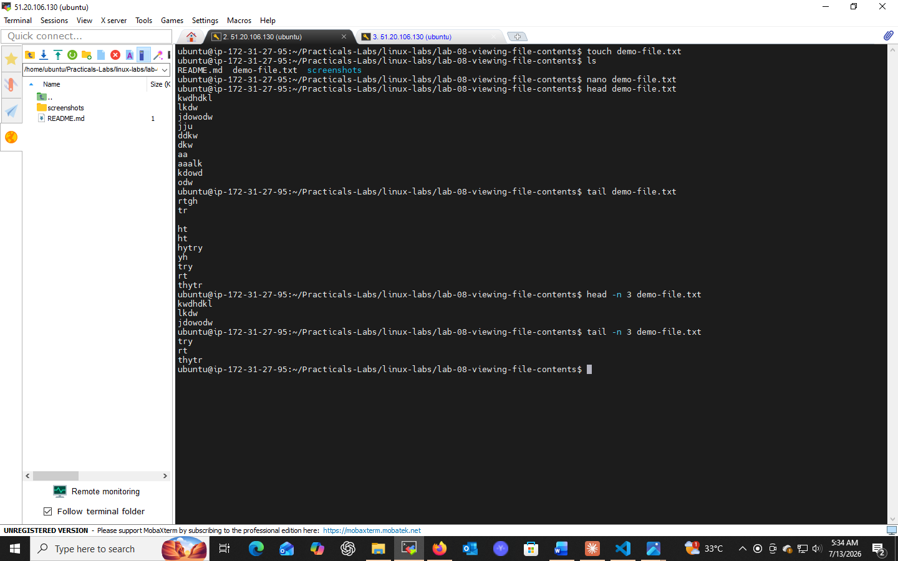
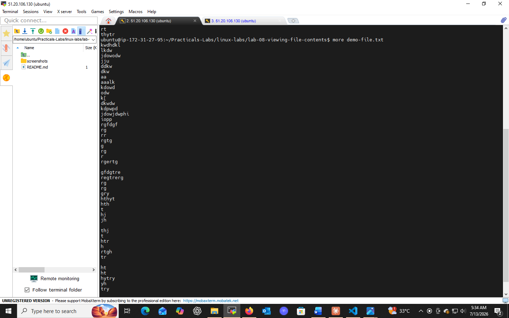

# Lab 08: Viewing File Contents

## 📌 Objectives
- Familiarize with commands for viewing file contents in the terminal
- Learn to extract and search specific text within files
- Understand the differences between `head`, `tail`, `more`, and `grep`

## 🔧 Prerequisites
- Basic knowledge of using a terminal
- Access to a Linux-based OS or terminal emulator

## 💻 Tasks & Commands

### Task 1: View the Start of a File (`head`)
```bash
head filename.txt        # first 10 lines
head -n 5 filename.txt   # first 5 lines
```

### Task 2: View the End of a File (`tail`)
```bash
tail filename.txt         # last 10 lines
tail -n 15 filename.txt   # last 15 lines
```

### Task 3: Page Through a File (`more`)
```bash
more filename.txt
```
- `Spacebar` → scroll one page
- `Enter` → scroll one line
- `q` → quit

### Task 4: Search Within a File (`grep`)
```bash
grep "search-term" filename.txt
grep -i "search-term" filename.txt          # case-insensitive
grep -r "search-term" /path/to/directory    # recursive search
```

## 🎯 Key Concepts
| Command | Purpose |
|---------|---------|
| `head` | View beginning of a file |
| `tail` | View end of a file |
| `more` | Interactive page-by-page viewing |
| `grep` | Search text patterns within files |

## ✅ Conclusion
These four commands are the backbone of navigating and filtering text files and logs efficiently in any Unix/Linux environment.

## 📸 Practice Screenshot



