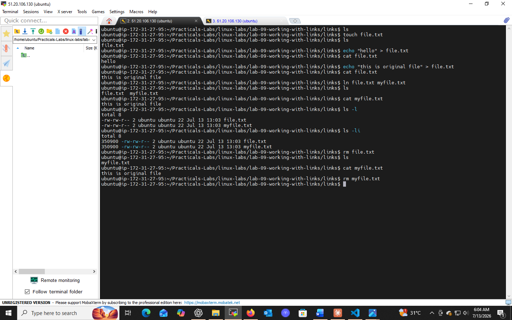
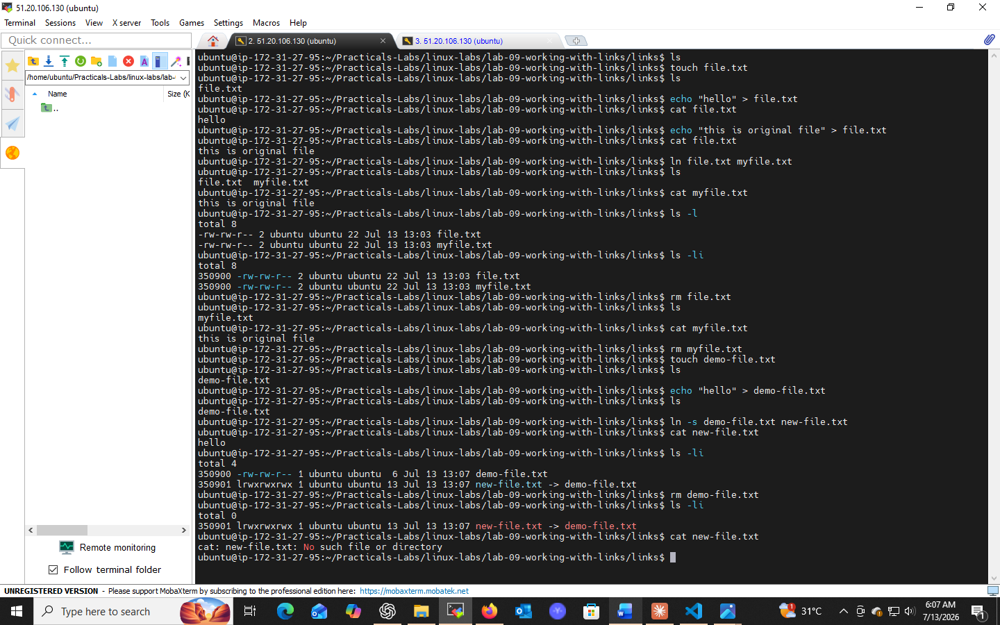

# Lab 09: Working with Links

## 📌 Objectives
- Understand the difference between hard links and symbolic links
- Learn to create hard and symbolic links via CLI
- Compare file sizes and inodes of both link types

## 🔧 Prerequisites
- Basic knowledge of navigating the Linux command line
- Basic understanding of file systems and inodes

## 💻 Tasks & Commands

### Task 1: Create a Hard Link (`ln`)
```bash
mkdir ~/link_lab && cd ~/link_lab
echo "This is the original file." > original.txt
ln original.txt hardlink.txt
```
A hard link points **directly to the same inode** as the original file.

### Task 2: Create a Symbolic Link (`ln -s`)
```bash
ln -s original.txt symlink.txt
```
A symbolic link (symlink) is a reference/pointer to the original file's **path**, not its inode.

### Task 3: Compare File Sizes and Inodes
```bash
ls -l    # compare link counts and sizes
ls -i    # view inode numbers
```
- **Hard links** share the same inode number as the original (same physical file)
- **Symbolic links** have a different inode and smaller size (they only store a path)

## 🎯 Key Concepts
| Link Type | Points To | Inode |
|-----------|-----------|-------|
| Hard Link | Same data on disk | Same as original |
| Symbolic Link | Path/name of original file | Different (own inode) |

## ✅ Conclusion
Hard links share the physical file directly; symlinks offer flexibility (even across filesystems) by pointing to the file's path. Both are foundational for filesystem and software management.

## 📸 Practice Screenshot


