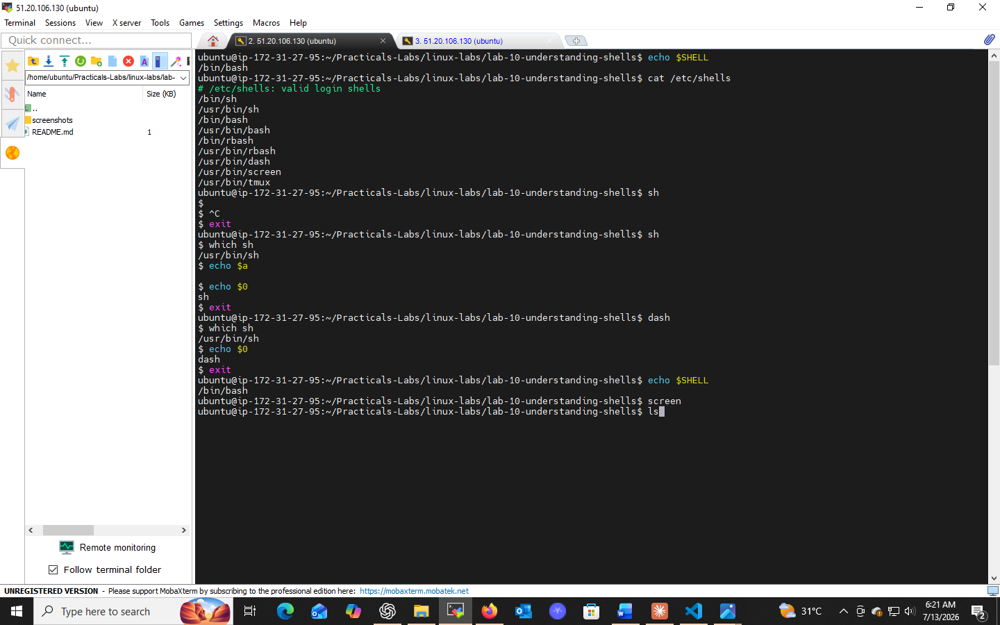

# Lab 10: Understanding Shells

## 📌 Objectives
- Understand the concept and purpose of a shell
- Learn to check the default shell for a user
- List and identify available shells on a system
- Practice switching between different shells

## 🔧 Prerequisites
- Basic knowledge of OS and CLI concepts
- Access to a Unix-like operating system

## 💻 Tasks & Commands

### Task 1: Check the Default Shell
```bash
echo $SHELL
```
`$SHELL` displays the path of the default shell for the logged-in user (e.g. `/bin/bash`, `/bin/zsh`).

### Task 2: List Available Shells
```bash
cat /etc/shells
```
Displays all shells installed and registered on the system, e.g.:
```
/bin/sh
/bin/bash
/usr/bin/zsh
/bin/dash
```

### Task 3: Switch to Another Shell
```bash
sh
echo $0
```
Typing a shell's name switches the session to it. `$0` reflects the current shell's name — useful to verify the switch.

## 🎯 Key Concepts
| Command | Purpose |
|---------|---------|
| `echo $SHELL` | Show default shell |
| `cat /etc/shells` | List installed shells |
| `echo $0` | Show currently active shell |

## ✅ Conclusion
Understanding shells — and how to identify/switch between them — is fundamental groundwork before diving into shell scripting and automation.

## 📸 Practice Screenshot

