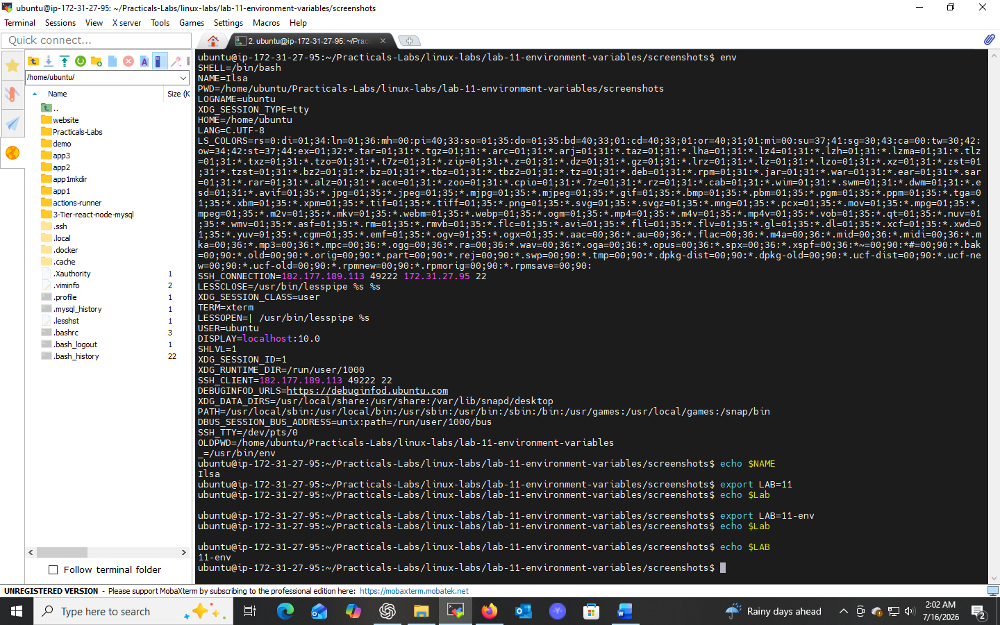

# Lab 11: Environment Variables

## 📌 Objectives
- Understand what environment variables are and how they function
- Learn to view, set, and unset environment variables
- Demonstrate their use in scripts and shell operations

## 🔧 Prerequisites
- Basic understanding of shell commands and terminal navigation
- A text editor like `vi`, `nano`, or `gedit`

## 📝 Introduction
Environment variables are key-value pairs available to programs and scripts running on the OS. They store system-wide values like configuration settings, file paths, and preferences.

## 💻 Tasks & Commands

### Task 1: View Current Environment Variables
```bash
env
```
Lists all environment variables in the current shell session in `KEY=VALUE` format (e.g., `PATH`, `HOME`, `USER`).

### Task 2: Set a New Environment Variable
```bash
export MYVAR="Hello"
echo $MYVAR
```
`export` creates the variable and makes it available to all child processes of the shell.

### Task 3: Unset an Environment Variable
```bash
unset MYVAR
echo $MYVAR   # should return blank
```
Removes the variable from the current shell environment.

## 🎯 Key Concepts
| Command | Purpose |
|---------|---------|
| `env` | List all environment variables |
| `export VAR=value` | Create/export a variable |
| `unset VAR` | Remove a variable |

## ✅ Conclusion
Environment variables are critical for writing efficient shell scripts and automating tasks. Mastering `env`, `export`, and `unset` gives you full control over your shell's runtime configuration.

## 📸 Practice Screenshot


