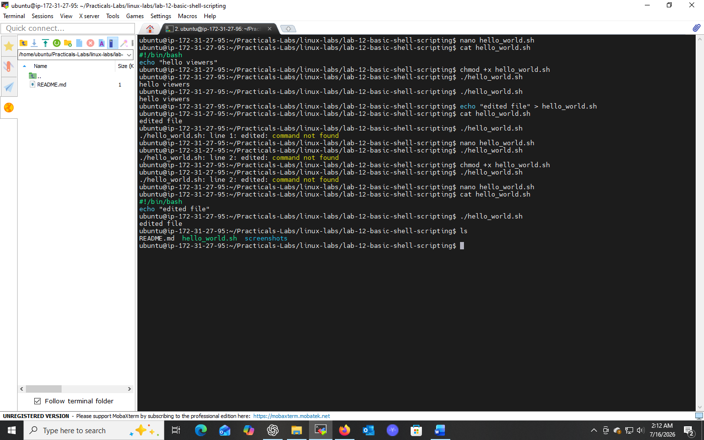

# Lab 12: Basic Shell Scripting

## 📌 Objectives
- Understand the basics of shell scripting
- Learn to write, make executable, and run a simple shell script
- Gain experience with Linux CLI operations

## 🔧 Prerequisites
- Basic understanding of Linux OS and terminal
- Familiarity with `echo`, `chmod`, and `./`

## 💻 Tasks & Commands

### Task 1: Write a Simple Shell Script
```bash
nano hello_world.sh
```
Inside the file:
```bash
#!/bin/bash
echo "Hello World!"
```
The `#!/bin/bash` (shebang) line tells the system which interpreter to use to run the script.

### Task 2: Make the Script Executable
```bash
chmod +x hello_world.sh
```
`+x` adds execute permission, allowing the script to run directly.

### Task 3: Run the Script
```bash
./hello_world.sh
```
Expected output:
```
Hello World!
```

## 🎯 Key Concepts
| Concept | Meaning |
|---------|---------|
| Shebang (`#!/bin/bash`) | Specifies the script's interpreter |
| `chmod +x` | Makes a script executable |
| `./script.sh` | Runs the script from the current directory |

## ✅ Conclusion
Wrote, permissioned, and executed a basic shell script — the foundational workflow for all future automation and scripting tasks.

## 📸 Practice Screenshot


