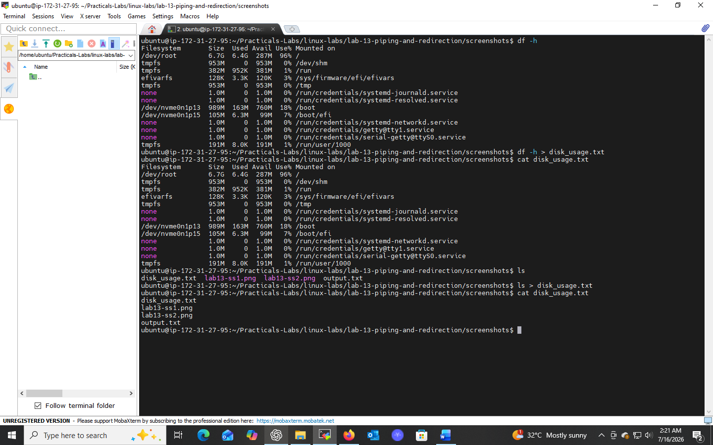
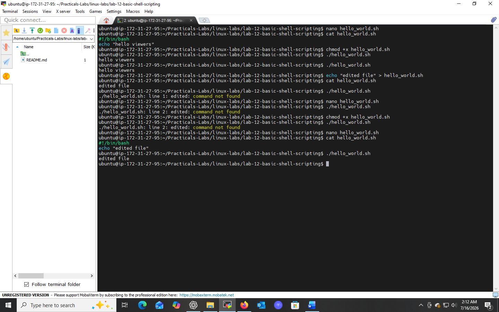
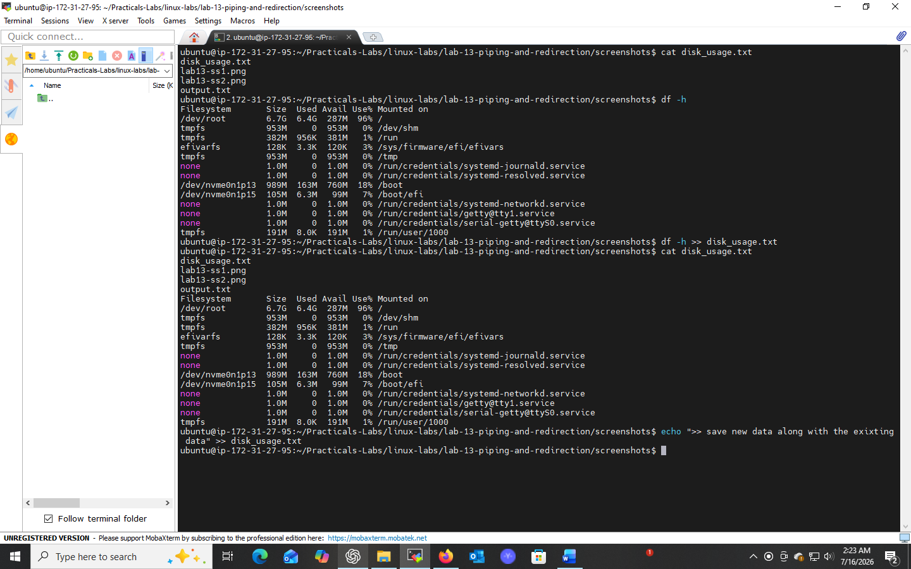
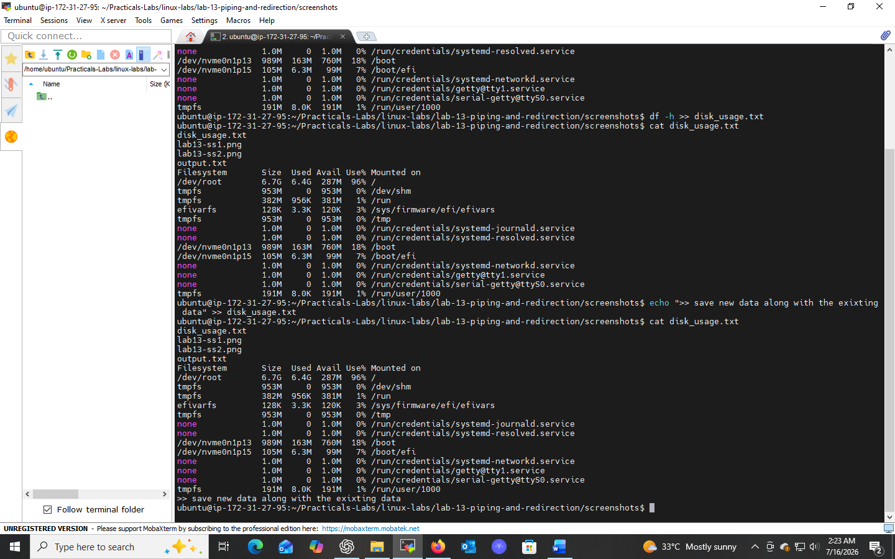
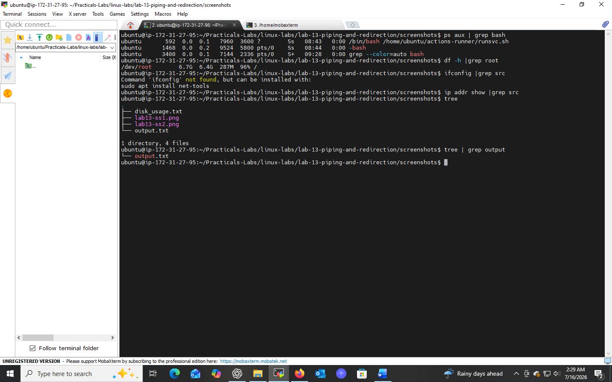

# Lab 13: Using Piping and Redirection

## 📌 Objectives
- Understand input/output redirection in Linux
- Learn to redirect command output to files
- Explore appending output to existing files
- Master piping to connect multiple commands

## 🔧 Prerequisites
- Familiarity with basic Linux commands
- Access to a Linux CLI

## 💻 Tasks & Commands

### Task 1: Redirect Output to a File (`>`)
```bash
ls > output.txt
cat output.txt
```
`>` sends command output to a file, **overwriting** it if it already exists.

### Task 2: Append Output to a File (`>>`)
```bash
echo "Additional content" >> output.txt
cat output.txt
```
`>>` **adds** to the file instead of replacing its contents.

### Task 3: Pipe Output Between Commands (`|`)
```bash
ps aux | grep bash
```
Piping (`|`) passes the output of one command as input to another — enabling powerful command chains.

## 🎯 Key Concepts
| Operator | Purpose |
|----------|---------|
| `>` | Redirect output (overwrite) |
| `>>` | Redirect output (append) |
| `\|` | Pipe output from one command to another |

## ✅ Conclusion
Redirection and piping are core to efficient command-line usage — they allow chaining simple commands into powerful, automated workflows.


## 📸 Practice Screenshot





