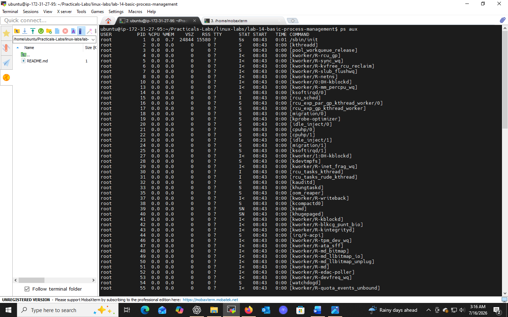
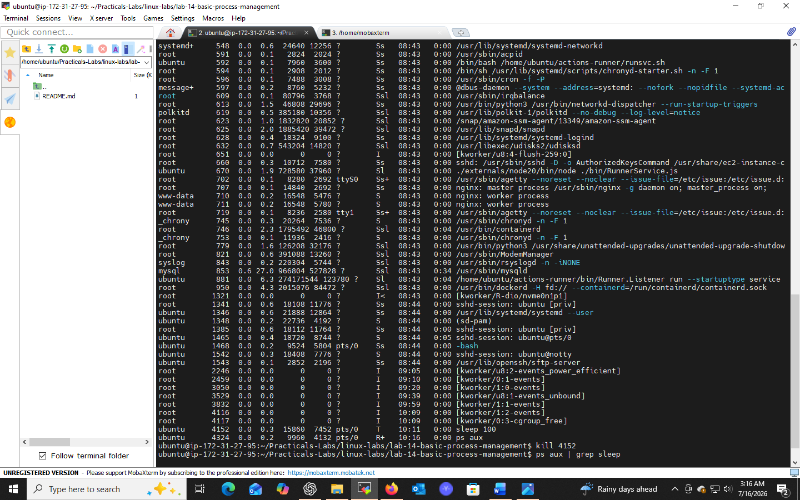
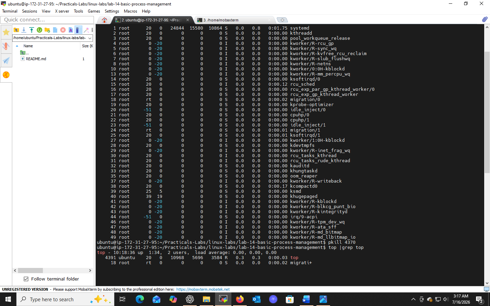

# Lab 14: Basic Process Management

## 📌 Objectives
- Understand the basics of process management in Unix/Linux
- Learn to list running processes and interpret the data
- Master killing a process by both PID and process name

## 🔧 Prerequisites
- Basic knowledge of the Unix/Linux CLI
- Access to a Unix/Linux system or terminal emulator

## 💻 Tasks & Commands

### Task 1: List Running Processes
```bash
ps aux
```
| Flag | Meaning |
|------|---------|
| `a` | All users' processes |
| `u` | Detailed listing |
| `x` | Processes without controlling terminal |

Key output fields: `USER`, `PID`, `%CPU`, `%MEM`, `COMMAND`

```bash
top
```
Real-time view of active processes and resource usage. Press `q` to quit, `h` for help.

### Task 2: Kill a Process by PID
```bash
kill <PID>       # graceful termination (SIGTERM)
kill -9 <PID>     # force kill (SIGKILL)
```

### Task 3: Kill a Process by Name
```bash
pkill -x <process_name>
# example:
pkill -x firefox
```

## 🎯 Key Concepts
| Command | Purpose |
|---------|---------|
| `ps aux` | Snapshot of all running processes |
| `top` | Real-time process monitor |
| `kill` | Terminate a process by PID |
| `pkill` | Terminate a process by name |

## 💡 Case Study: High CPU Usage
Use `top` to identify resource-heavy processes, then selectively use `kill`/`pkill` to terminate them and relieve system load.

## ✅ Conclusion
Learned to monitor, analyze, and manage running processes — a core system administration skill for maintaining performance and stability.

## 📸 Practice Screenshot




