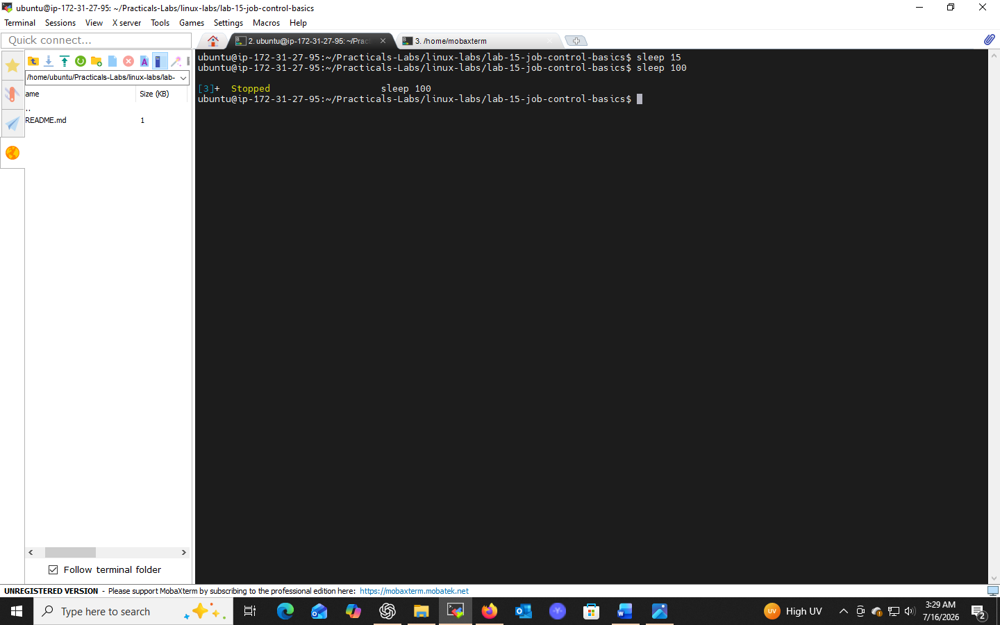
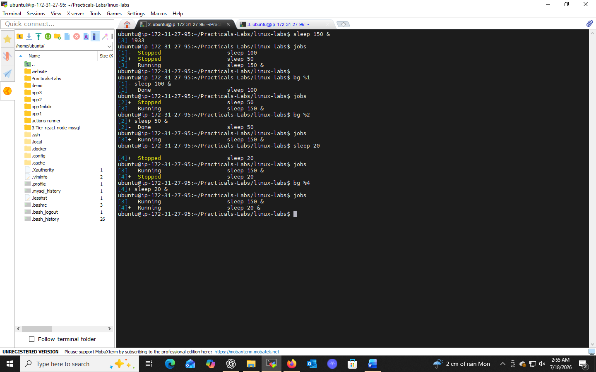

# Lab 15: Job Control Basics

## 📌 Objectives
- Understand job control in Unix/Linux operating systems
- Learn to manage background and foreground processes
- Practice `Ctrl+Z`, `bg`, and `fg`

## 🔧 Prerequisites
- Basic understanding of Unix/Linux commands and terminal usage
- Access to a Unix/Linux system with terminal access

## 💻 Tasks & Commands

### Task 1: Start a Long-Running Process
```bash
sleep 100
```
Pauses the terminal for 100 seconds — simulates a long-running foreground task.

### Task 2: Suspend the Process
Press `Ctrl+Z` while `sleep` is running.
This suspends the foreground process and moves it to the background as a **stopped job**, freeing the terminal.

### Task 3: Resume in the Background
```bash
bg
jobs
```
`bg` resumes the suspended job in the background. `jobs` lists all jobs, e.g.:
```
[1]+  Running    sleep 100 &
```

### Task 4: Bring the Process to the Foreground
```bash
fg %1
```
`fg` returns job `%1` to the foreground for direct interaction (replace `1` with the actual job ID).

## 🎯 Key Concepts
| Command | Purpose |
|---------|---------|
| `Ctrl+Z` | Suspend the current foreground process |
| `bg` | Resume a suspended job in the background |
| `fg` | Bring a background job to the foreground |
| `jobs` | List all jobs in the current session |

## ✅ Conclusion
Mastering job control (`bg`, `fg`, `jobs`) enables efficient multitasking directly from a single terminal session — a key productivity skill for Linux users and admins.

## 📸 Practice Screenshot



