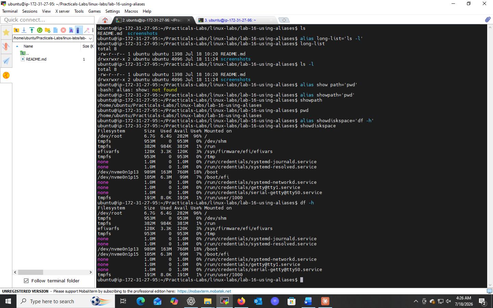
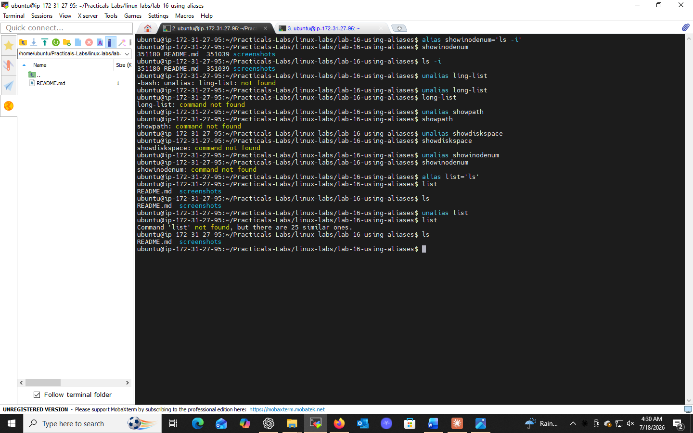

# Lab 16: Using Aliases

## 📌 Objectives
- Understand the concept of aliases in Linux
- Learn how to create, use, and remove temporary aliases
- Explore practical use cases for command automation using aliases

## 🔧 Prerequisites
- Basic understanding of the Linux command line
- Access to a Linux terminal

## 📝 What is an Alias?
An alias is a shortcut for a command or series of commands — it makes long or complex commands shorter, easier to remember, and faster to type.

## 💻 Tasks & Commands

### Task 1: Create a Temporary Alias
```bash
alias ll='ls -l'
```
Creates an alias `ll` that runs `ls -l`.

### Task 2: Test the Alias
```bash
ll
```
Behaves exactly like `ls -l` — detailed file listing.

### Task 3: Remove the Alias
```bash
unalias ll
ll   # now returns "command not found"
```

## 🎯 Key Concepts
| Command | Purpose |
|---------|---------|
| `alias name='command'` | Create a temporary alias |
| `unalias name` | Remove an alias |

## 💡 Note: Temporary vs Permanent
Aliases created with `alias` are **session-specific** — they disappear when the terminal closes. To make an alias permanent, add it to `~/.bashrc` or `~/.zshrc`:
```bash
echo "alias ll='ls -l'" >> ~/.bashrc
source ~/.bashrc
```

## ✅ Conclusion
Aliases simplify repetitive commands and personalize the shell experience — a small but powerful step toward shell scripting and automation.

## 📸 Practice Screenshot


