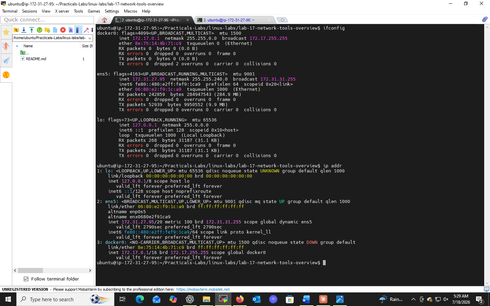
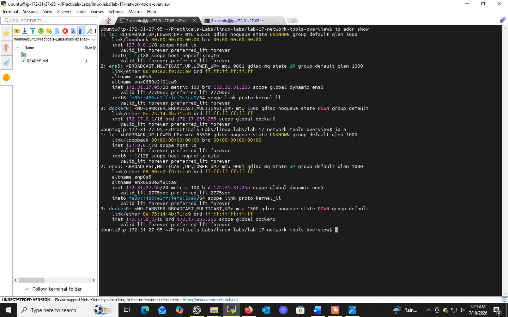
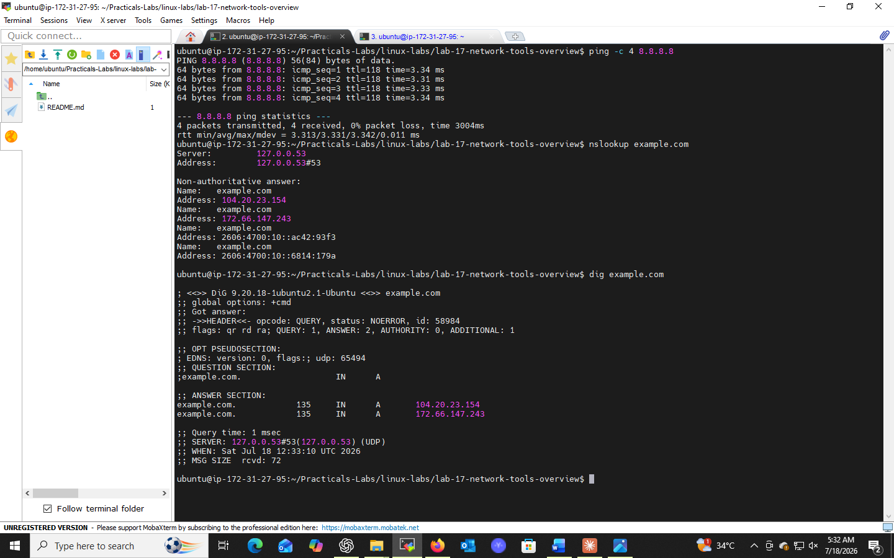

# Lab 17: Network Tools Overview

## 📌 Objectives
- Understand network configuration using `ifconfig` and `ip addr`
- Learn to test network connectivity using `ping`
- Explore DNS information using `nslookup` and `dig`

## 🔧 Prerequisites
- Basic Linux CLI operations
- Internet connectivity to test network tools

## 💻 Tasks & Commands

### Task 1: Check Network Configuration
```bash
sudo ifconfig
```
Displays IP address, netmask, and broadcast address for network interfaces (legacy tool).

```bash
ip addr show
```
Modern equivalent (part of `iproute2`) — identifies interfaces like `eth0`, `lo` with detailed info.

### Task 2: Test Connectivity
```bash
ping -c 4 8.8.8.8
```
- `-c 4` → sends exactly 4 echo requests
- Measures **round-trip time** to the target host

### Task 3: DNS Lookups
```bash
nslookup example.com
```
Queries DNS to retrieve a domain's IP address or other records.

```bash
dig example.com
```
More verbose/flexible DNS query tool — shows `ANSWER SECTION`, `QUERY TIME`, etc.

## 🎯 Key Concepts
| Command | Purpose |
|---------|---------|
| `ifconfig` / `ip addr` | View network interface configuration |
| `ping` | Test host reachability |
| `nslookup` / `dig` | Query DNS records |

## ✅ Conclusion
These tools form the foundation of network diagnostics — essential for troubleshooting connectivity, DNS, and configuration issues in any Linux environment.

## 📸 Practice Screenshot



