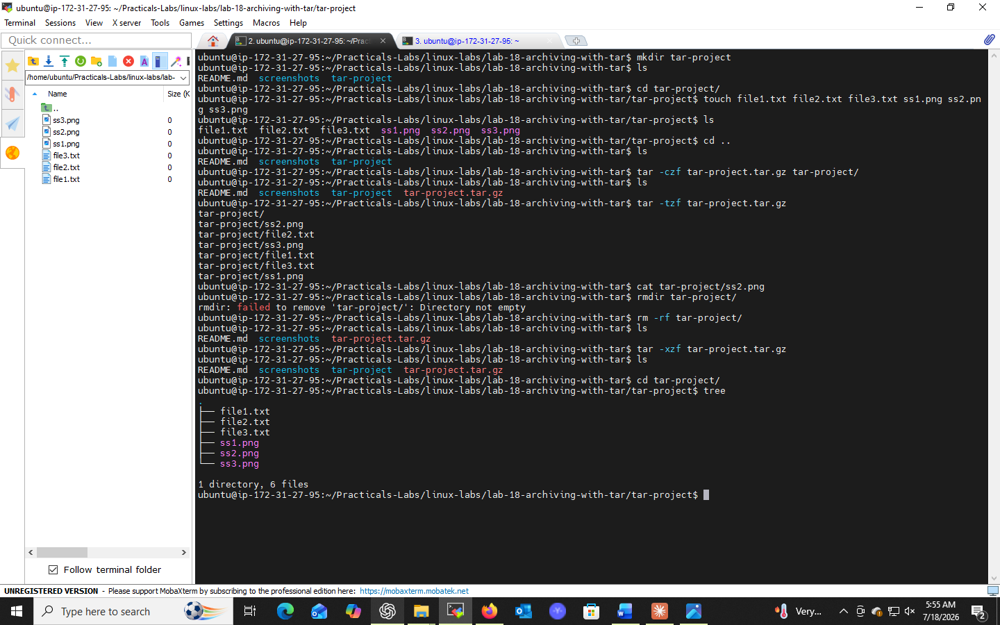

# Lab 18: Archiving with tar

## 📌 Objectives
- Understand how to create compressed tar archives
- Learn to list contents of tar archives
- Extract files from tar archives efficiently

## 🔧 Prerequisites
- Basic Linux CLI navigation
- Access to a Linux environment with `tar` installed

## 📝 Introduction
`tar` (Tape Archive) combines many files into a single archive file, often paired with compression to reduce size.

## 💻 Tasks & Commands

### Task 1: Create a Compressed Archive
```bash
tar -czf archive.tar.gz /path/to/folder
# example:
tar -czf project_archive.tar.gz project
```
| Flag | Meaning |
|------|---------|
| `-c` | Create a new archive |
| `-z` | Compress using gzip |
| `-f` | Specify archive filename |

### Task 2: List Archive Contents
```bash
tar -tzf archive.tar.gz
```
`-t` lists contents **without extracting** them.

### Task 3: Extract the Archive
```bash
tar -xzf archive.tar.gz
```
`-x` extracts files from the archive into the current directory.

## 🎯 Key Concepts
| Flag | Purpose |
|------|---------|
| `-c` | Create archive |
| `-x` | Extract archive |
| `-t` | List archive contents |
| `-z` | gzip compression |
| `-f` | Specify filename |

## 💡 Case Study
A dev team archiving project directories weekly can automate `tar` commands via a script or cron job for reliable, efficient backups.

## ✅ Conclusion
`tar` is essential for backups, data transfer, and storage management — one of the most-used tools in Linux system administration.

## 📸 Practice Screenshot


