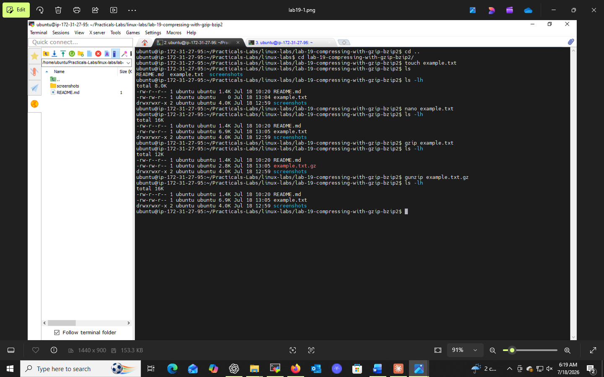
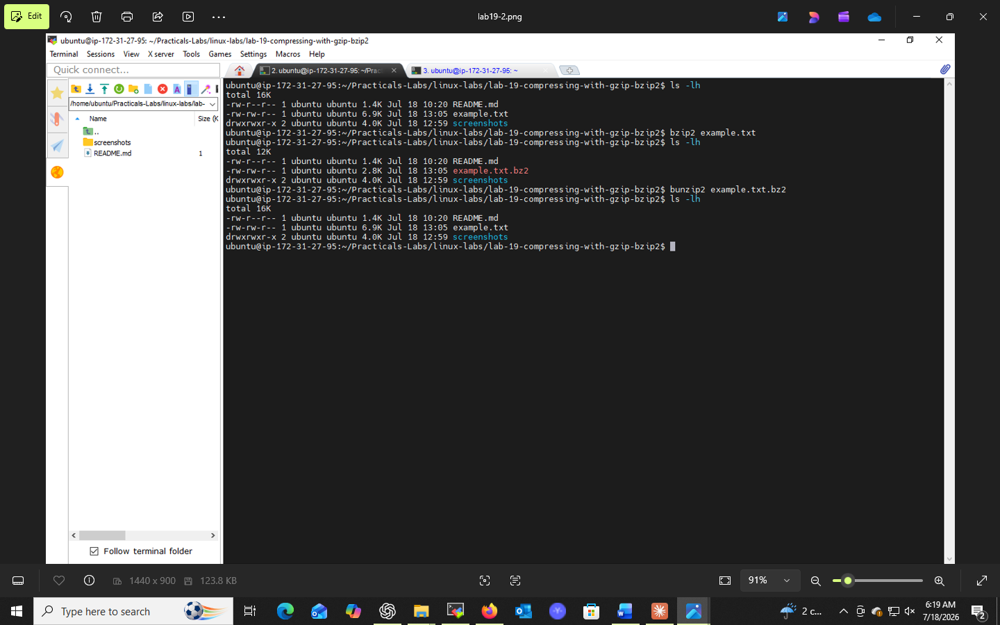

# Lab 19: Compressing with gzip and bzip2

## 📌 Objectives
- Understand the basics of file compression and decompression
- Learn to use `gzip` and `bzip2` for compressing files
- Practice `gunzip` and `bunzip2` for decompression
- Compare use-cases for `gzip` vs `bzip2`

## 🔧 Prerequisites
- Basic understanding of files/directories in Linux
- `gzip` and `bzip2` (commonly pre-installed)

## 💻 Tasks & Commands

### Task 1: Compress with gzip
```bash
ls -lh example.txt
gzip example.txt
ls -lh example.txt.gz
```
The original file is **replaced** by a `.gz` file.

### Task 2: Decompress with gunzip
```bash
gunzip example.txt.gz
ls -lh example.txt
```
Restores the original file.

### Task 3: Compress with bzip2
```bash
ls -lh sample.txt
bzip2 sample.txt
ls -lh sample.txt.bz2
```
`bzip2` gives a **higher compression ratio** than gzip, at slower speed.

### Task 4: Decompress with bunzip2
```bash
bunzip2 sample.txt.bz2
ls -lh sample.txt
```

## 🎯 Key Concepts
| Tool | Compress | Decompress | Trade-off |
|------|----------|-------------|-----------|
| gzip | `gzip file` | `gunzip file.gz` | Faster, lower ratio |
| bzip2 | `bzip2 file` | `bunzip2 file.bz2` | Slower, higher ratio |

## ✅ Conclusion
`gzip` favors speed; `bzip2` favors compression ratio. Choosing the right tool depends on whether speed or storage savings matters more for your use case.

## 📸 Practice Screenshot


