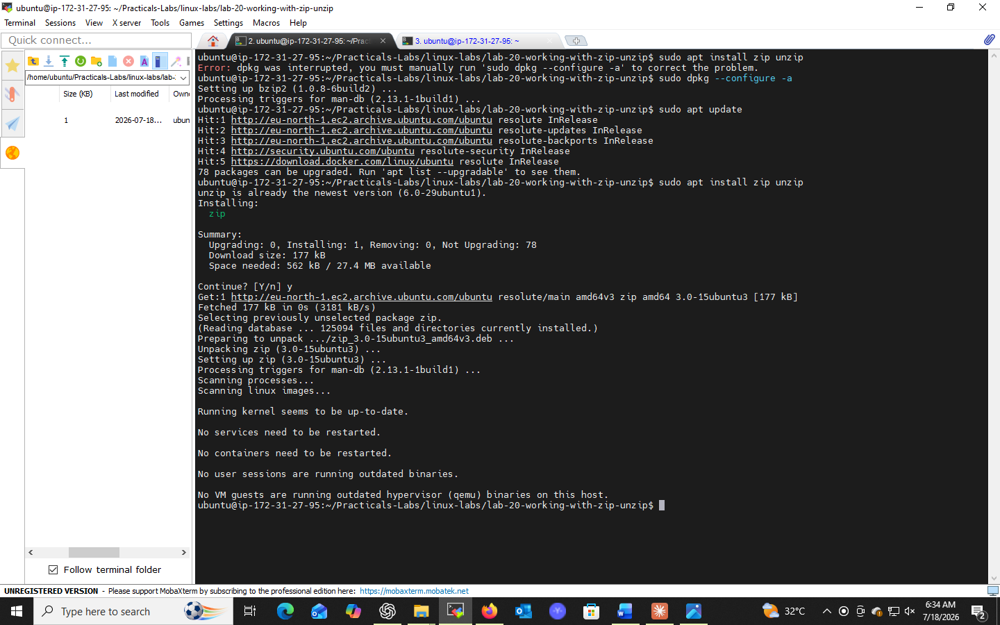
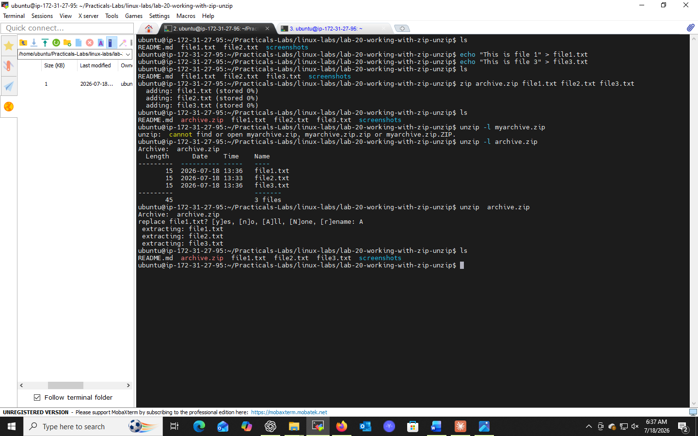

ls# Lab 20: Working with zip/unzip

## 📌 Objectives
- Understand how to use `zip` and `unzip` to compress/decompress files
- Learn to install `zip`/`unzip` if unavailable
- Gain practical skills in creating and extracting archives

## 🔧 Prerequisites
- Basic CLI familiarity
- Access to a Unix-like OS

## 💻 Tasks & Commands

### Task 1: Check / Install zip & unzip
```bash
zip -v
unzip -v
```
If not installed:
```bash
# Debian/Ubuntu
sudo apt-get update
sudo apt-get install zip unzip

# Red Hat/CentOS
sudo yum install zip unzip

# macOS (Homebrew)
brew install zip unzip
```

### Task 2: Zip Multiple Files
```bash
echo "This is file 1" > file1.txt
echo "This is file 2" > file2.txt
zip myarchive.zip file1.txt file2.txt
unzip -l myarchive.zip   # verify contents
```

### Task 3: Unzip the Archive
```bash
unzip myarchive.zip
ls
```

## 🎯 Key Concepts
| Command | Purpose |
|---------|---------|
| `zip archive.zip files` | Create a zip archive |
| `unzip -l archive.zip` | List contents without extracting |
| `unzip archive.zip` | Extract contents |

## ✅ Conclusion
`zip`/`unzip` are cross-platform-friendly compression tools, widely used for file storage and transfer across different operating systems.

## 📸 Practice Screenshot


